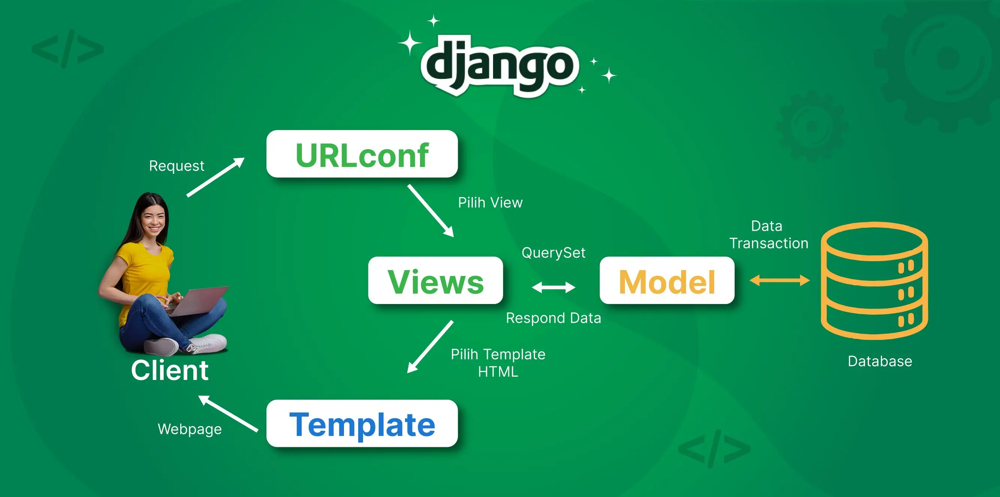

https://emilio-junino-inazumasportswear.pbp.cs.ui.ac.id/

Tugas 2
Pertanyaan pertama:
1. Membuat direktori baru secara lokal dengan nama inazuma-sportswear agar bisa dipakai untuk project django dan repo github
2. Setelah membuat direktori lokal, saya membuat repo kosong pada github dengan nama inazuma-sportswear yang nanti akan dihubungkan dengan folder local
3. Membuat copy requirements.txt dari tutorial pbp kepada inazuma-sportswear agar bisa digunakan nanti pada command terminal
4. Membuka direktori inazuma-sportswear pada command terminal lalu menyalakan virtual environment agar bisa menjalankan requirements.txt untuk menginstalasi keperluan django serta django sendiri ke direktori tersebut
5. Setelah instalasi django pada direktori inazuma-sportswear, saya menggunakan command terminal untuk membuat projek django bernama inazuma_sportswear
6. Selanjutnya saya memmbuat file .env dan .envprod pada direktori root proyek untuk menyimpan konfigurasid database dan pengaturan environment ("production = false" pada .env)
7. Setelah membuat kedua file tersebut, saya menambahkan beberapa line kode pada setttings.py agar bisa menggunakan file tersebut dan juga membuat agar projek bisa berjalan secara lokal
8. Step terakhir sebelum saya lanjut ke Pacil Web Service dan upload ke repository github adalah migrasi database dengan menggunakan manage.py
9. Sebelum ke Pacil Web Service, saya harus upload ke github terlebih dahulu dengan pertama membuat .gitignore agar tidak melakukan push terhadap file-file yang tidak diinginkan
10. Membuat file repo github ke direktori lokal setelah melakukan git init dengan melakukan git remote add lalu membuat branch bernama master 
11. Melakukan add, commit, dan push ke github repo
12. Membuat proyek pada Pacil Web Service lalu mengubah environs agar sesuai dengan .envprod lalu menambahkan url pws pada settings.py agar bisa dibuka websitenya nanti
13. Setelah semua itu, saya menjalankan command yang ada di bagian build proyek pws agar mulai dibangun website dan bisa dibuka (tidak lupa juga untuk memasukkan password yang sebelumnya disimpan)
14. Membuka website dari view proyek di Pacil Web Service dan memastikan tidak ada masalah
15. Setelah saya memastikan bahwa website sudah aman, saya menjalankan git push pws master agar tersimpan
16. Karena website sudah berjalan dengan aman, saya mulai membuat MVT dengan pertama membuat aplikasi bernama main melalui virtual environment di inazuma-sportswear
17. Setelah membuat aplikasi "main" tersebut, saya menambahkannya pada bagian allowed apps di settings.py agar terdaftar pada proyek
18. Untuk pembuatan MVT proyek, pertama saya membuat model.py pada direktori aplikasi "main" dan mengisinya dengan kode berdasarkan spesifikasi yang diberikan pada tugas
19. Setelah membuat model.py, saya melakukan migrasi dengan pertama menjalankan makemigration yaitu migrasi yang belum teraplikasi ke database lalu menjalani migrate agar mengaplikasikan perubahannya
20. Setelah model.py saya melanjut dengan mengubah views.py pada berkas aplikasi "main" agar memiliki dictionary nama dan kelas agar bisa digunakan dengan template html yang nanti dibuat
21. Membuat folder template pada berkas aplikasi "main" dan di dalamnya membuat file main.html yang berisi format untuk menampilkan nama aplikasi (main) dan nama dan kelas berdasarkan dictionary dari views.py 
22. Setelah MTV sudah selesai, saya melakukan routing url aplikasi main melalui pembuatan urls.py di dalam direktorinya
23. urls.py tersebut saya isi dengan kode yang akan memanggil views.py ketika url cocok
24. setelah melakukan routing pada aplikasi, saya melakukan juga routing pada urls.py pada direktori proyek yang menggunakan urls.py dari direktori aplikasi main
25. melakukan push ke github dan pws
26. membuat readme.md
27. melakukan push terakhir ke github dan pws

Pertanyaan kedua:

Source(https://www.biznetgio.com/news/django)

Bagan tersebut menunjukkan alur dari request sebuah client ke web, pertama sebuah client melakukan request yang selanjutnya akan diterima oleh URL yang setelah diterima akan diarahkan ke views yang sesuai dengannya. Views akan menggunakan model untuk memilih template sesuai agar bisa menampilkan halaman web yang sesuai dengan request client. 

urls.py memanggil fungsi pada views.py agar bisa menemukan template yang cocok berdasarkan request client
views.py memilih template html yang sesuai setelah mengambil data dari model untuk menampilkan halaman web yang diminta client
template html berisi bentuk/struktur penampilan data yang digunakan bersamaan dengan data dari views.py untuk menampilkan halaman web yang diminta client

Pertanyaan ketiga:
Settings.py berkerja seperti namanya sebagai setting atau konfiguasi dari suatu proyek django. Dengan mengubah isi dari settings.py maka seorang dapat mengubah allowed host dan aplikasi yang terdaftar.

Pertanyaan keempat:
Migrasi databse pada django berkerja dengan pertama melakukan makemigrations yaitu memindahkan models.py lalu membuat file migrasi baru pada folder migrations. Makemigrations dilakukan untuk mengetahui perubahan pada model sebelum dimasukkan ke database. Setelah makemigrations dilakuakan migrate yaitu pembacaan file migrasi oleh django yang selanjutnya akan menjalankan sql dan menerapkan perubahan model ke database.

Pertanyaan kelima:
Menurut saya django dipilih karena berbagai alasan:
1. Menggunakan bahasa python yang merupakan bahasa pemula
2. Menyediakan semua yang diperlukan seorang developer tanpa perlu download lebih
3. Menerapkan pola desain MTV yang merupakan pola mudah dipahami dan membantu membuat kebiasaan yang baik pada developer pemula 

Feedback asdos:
1. Penjelasan pada website harap lebih detail
2. Berikan contoh bagaimana tugasnya seharusnya terlihat agar bisa lebih mudah untuk mahasiswa mengetahui apakah sudah sesuai atau belum

Tugas 3
Pertanyaan pertama:
Data delivery diperlukan untuk memenuhi keperluan platform untuk menunjuk dan mengirim data yang diperlukan sehingga bagian-bagian dari suatu sistem dapat berkomunikasi

Pertanyaan kedua:
Menurut saya yang lebih baik antara XML dan JSON adalah JSON. Alasan mengapa saya memilih JSON sama seperti mengapa JSON lebih populer dibanding XML yaitu:
1. Bahasa/Sintaks yang lebih mudah dipahami
2. Merupakan tipe data javascript

Pertanyaan ketiga:
Fungsi is_valid pada form berfungsi untuk mengecek kesesuaiaan/memvalidasi data yang dikirim oleh form tersebut sehingga dibutuhkan untuk mengamankan database agar tidak dimasuki data-data tidak sesuai.

Pertanyaan keempat:
csrf_token diperlukan pada form untuk mencegah serangan siber dengan memberikan token unik ke sebuah url. Tanpa csrf_token maka tidak memiliki cara untuk memvalidasikan sumber sebuah request sehingga bisa digunakkan oleh penyerang untuk menjalankan CSRF atau Cross-Site Request Forgery.

Pertanyaan kelima:
1. membuat folder template pada direktori utama dan mengisinya dengan kerangka untuk halaman web lain bernama base.html dan juga menambahkannya ke settings.py
2. membuat file forms.py pada direktori main yang bisa menerima data produk
3. menambahkan & memperbarui fungsi dan import pada views.py agar bisa menerima context produk dan membuat serta menampilkan produk
4. menambahkan fungsi-fungsi yang sebelumnya dibuat ke urls.py pada direktori main agar bisa digunnakan saat routing
5. mengubah main.html pada direktori main agar bisa menampilkan produk serta menyertakan tombol "add produk"
6. membuat dua file html baru yang akan digunakan untuk menampilkan detail produk serta membuat produk menggunakan form bernama "create_protduct.html" dan "product_detail.html"
7. menambahkan "CSRF_TRUSTED_ORIGINS" pada settings.py karena digunakan pada "create_protduct.html" untuk memvalidasi data yang dikirim
8. menambahkan import HttpResponse dan Serializer pada views.py agar bisa menampilkan dalam bentuk xml dan json
9. membuat fungsi untuk menunjukan dalam bentuk json dan xml pada views.py yang mengambil semua objek produk lalu menggunakan serializer untuk menampilkannya ke bentuk yang diinginkan
10. membuat fungsi yang mirip dengan sebelumnya tetapi menambahkan filter berdasarkan id agar bisa menampilkan data yang sesuai dengan id dan juga menampilkan error jika tidak ada id yang dicari
10. import keempat fungsi tersebut ke urls.py pada direktori main dan menambahkan path url ke urlpatterns
11. menjalankan website secara local dan memastikan berhasil secara normal, xml, json, serta berdasarkan id
12. menggunakan postman untuk melihat xml, json, dan berdasarkan id serta mengambil screenshot
13. menjawab readme.md
14. push ke git dan pws

Feedback:
1. Sama seperti pada Tugas 2, contoh hasil akhir agar bisa mengetahui kesesuaiaan website

screenshot postman:

